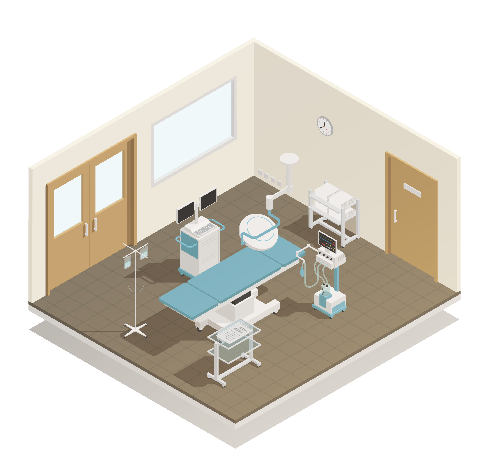

<!-- PROJECT LOGO -->
<br />
<p align="center">
    
    </br>
    <a href='https://www.freepik.com/vectors/building'>Building vector created by macrovector - www.freepik.com</a>

  <h2 align="center">Operating Room VR Experience</h2>

  <p align="center">
    Learn from your home
  </p>
  </br>

</p>


<!-- TABLE OF CONTENTS -->
<details open="open">
  <summary>Table of Contents</summary>
  <ol>
    <li>
      <a href="#about-the-project">About The Project</a>
      <ul>
        <li><a href="#statement-of-purpose">Statement of purpose</a></li>
        <li><a href="#persona">Persona</a></li>
        <li><a href="#sketch">Sketch</a></li>
        <li><a href="#built-with">Built With</a></li>
      </ul>
    </li>
    <li><a href="#user-testing">User testing</a></li>
    <ul>
        <li><a href="#user-testing-1-the-interface">User testing 1: The interface</a></li>
        <li><a href="#user-testing-2-mechanics">User testing 2: Motion and mechanics</a></li>
        <li><a href="#user-testing-final-user-test">User testing 3: Integration</a></li>
    </ul>
    <li>
      <a href="#getting-started">Getting Started</a>
      <ul>
        <li><a href="#prerequisites">Prerequisites</a></li>
        <li><a href="#installation">Installation</a></li>
      </ul>
    </li>
    <li><a href="#usage">Usage</a></li>
    <li><a href="#license">License</a></li>
    <li><a href="#contact">Contact</a></li>
    <li><a href="#acknowledgements">Acknowledgements</a></li>
  </ol>
</details>


<!-- ABOUT THE PROJECT -->
## About The Project

Due to Covid-19 pandemic, almost all the activities must be performed online, this represent a challenge for the education, where the students can not gain relevant practical experience.

Being more specific, many medicine students cannot go to their practices in the hospital due to the new security messurements. All this leading in the lack of experience in some practical skills such as the general kwnoledge and manage of the operating rooms.

In order to help with this situation, I decided to create an inmersive virtual experience, where students from all years can begin their journey on knowing the operating room.

### Statement of purpose

Provide an interactive application where medicine students from all years can interact with the operating room remotely

### Persona

For a focus development, it is imperative to define the end-user of the application. In this case, our users are medicine students that cannot go to the operating room due to any restrictions but they want to go deep in their practical skills. They are going to be around their twenties

<table>
    <tr>
        <td>
            
        </td>
        <td>
            <h1> Cynthia, 20 </h1>
            <h3 style="color:grey"> Sophomore medicine student </h3>
            <h3><i>"Medicine is a lifestyle"</i></h3>
            <p>Summer is a sophomore medicine student. She is full with activites and do not have a lot of personal time. She uses many medicine software for studying and is willing to try new techologies for gaining more knowledge </p>
        </td>
    </tr>
</table>
<a href='https://www.freepik.com/photos/woman'>Woman photo created by senivpetro - www.freepik.com</a>

### Sketch

Before putting hands on, I develop a prototype using CoSpaces where I define a basic layout of the operating room

![CoSpaces initial distribution][co-spaces-initial-distribution]

The main idea is that the user will be able to move around the operating room via waypoints. In this circuit the user can interact with 6 differents components that will output an explanatory video

![CoSpaces booth 1][co-spaces-booth-1]

The videos will be triggered when the user clicks on some special item

![CoSpaces booth 1][co-spaces-booth-2]

The 6 stations that will exist on this version of the app are the following:
* Air venting
* Lamps
* Outlets
* Wired
* Boom
* Medical shelves

### Built With

* [Unity](https://unity.com)
* [CoSpaces](https://cospaces.io/edu/)

The models useds for the prototype and for building the final solution were taken from the asset store

* [Clinic - Operating room](https://assetstore.unity.com/packages/3d/props/interior/clinic-operating-room-92667)
* [3D Quest Markers](https://assetstore.unity.com/packages/3d/props/3d-quest-markers-51737)

The videos were taken from the [Surgical Tech Tips](https://www.youtube.com/channel/UC46H-DfI72qhXtUmOd794uQ) channel

## User Testing

For an accurate development an early user testing was needed. The dynamic was about asking some medicine students which information they consider to be most important, incorporate it to the prototype and iterate. Nevertheless, besides checking on the information, some usability test where included

### User testing 1: The interface

### User testing 2: Motion and mechanics

### User testing 3: Integration

<!-- GETTING STARTED -->
## Getting Started

To get a local copy up and running follow these simple example steps.

### Prerequisites
* [Unity 2018.4.31f1](https://unity3d.com/unity/qa/lts-releases)

### Installation

1. Clone the repository
```sh
git clone git@github.com:Diezaztek/Operating-Room.git
```

2. Change to the project folder
```sh
cd Operating-Room
```


<!-- USAGE EXAMPLES -->
## Usage


<!-- LICENSE -->
## License

Distributed under the MIT License. See `LICENSE` for more information.


<!-- CONTACT -->
## Contact

Project Link: [https://github.com/Diezaztek/Operating-Room](https://github.com/Diezaztek/Operating-Room)


<!-- MARKDOWN LINKS & IMAGES -->
<!-- https://www.markdownguide.org/basic-syntax/#reference-style-links -->
[co-spaces-initial-distribution]: images/co-spaces-initial-distribution.png
[co-spaces-booth-1]: images/co-spaces-booth-1.png
[co-spaces-booth-2]: images/co-spaces-booth-2.png
